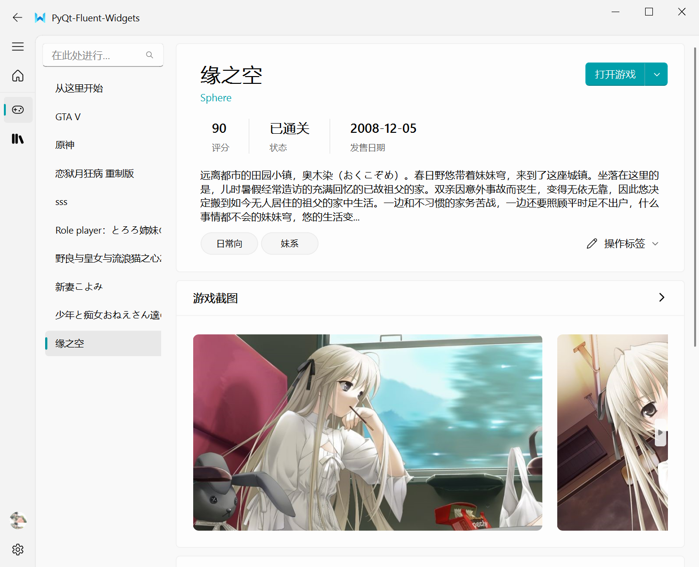
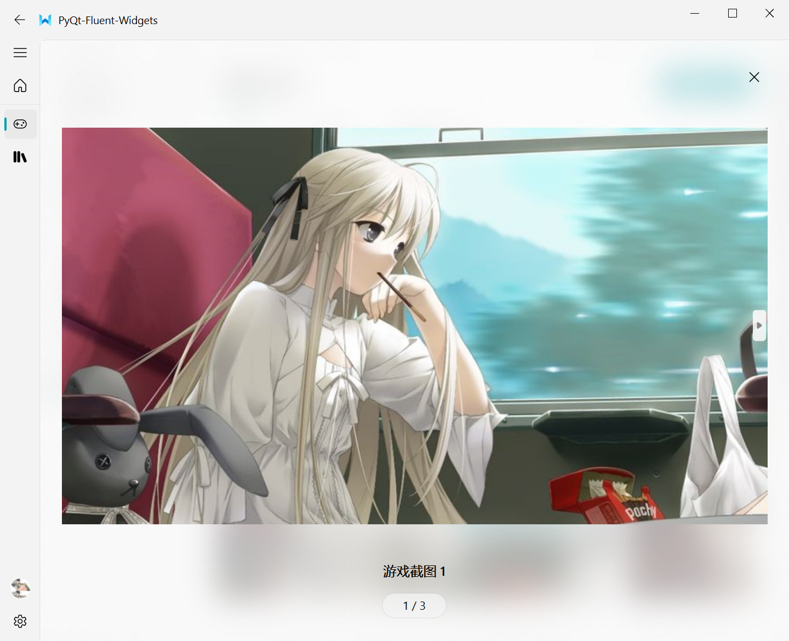
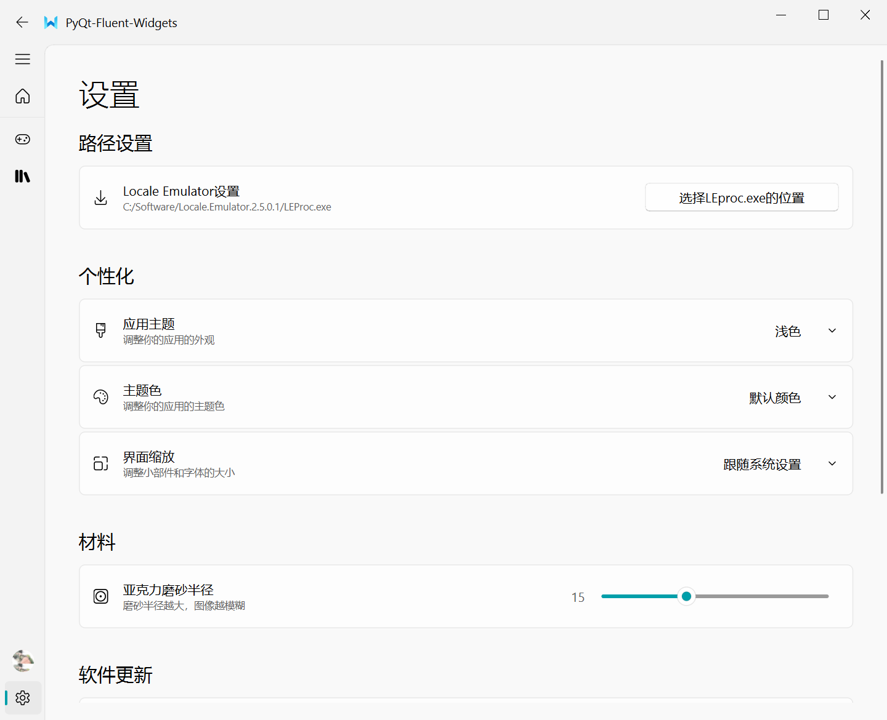

<p align="center">
  
</p>
  <h1 align="center">
  GALlauncher
</h1>
<p align="center">
  你的本地Galgame管理软件兼聚合启动器
</p>


## 介绍

电脑里有一堆galgame看着太乱？想要集中管理你的所有galgame的截图以便之后欣赏？你的本地Galgame管理软件兼聚合启动器来啦！GALlauncher基于[PyQt-Fluent-Widgets](https://github.com/zhiyiYo/PyQt-Fluent-Widgets/tree/master#--pyqt-fluent-widgets)，使用Python编写而成，是一款完全开源、本地运行的软件。

## 下载与使用

前往release界面[Releases · cyke262/gallery (github.com)](https://github.com/cyke262/gallery/releases)，下载任意压缩包，解压缩后点击demo.exe即可。

GALlauncher内置了使用引导，点击游戏管理界面的“从这里开始”就可以了解使用方法！

## 打包

推荐使用Pyinstaller打包，使用pip安装Pyinstaller

```
pip install PyInstaller
```

对本项目进行打包前务必确保Pyinstaller已更新至最新版本

```
pip3 install --upgrade PyInstaller pyinstaller-hooks-contrib
```

运行以下代码，若一切正常，在生成的dist文件夹中即为demo.exe文件

```
pyinstaller -D -w .\demo.py
```

此时点击demo.exe文件会产生报错，因为你还没有把数据文件包括进来。进入新生成的app文件夹，将原本项目下app文件夹内的config文件夹与resource文件夹复制粘贴到新的app文件夹中。你现在的文件结构应该是：

```
C:.
├─app
│  ├─config
│  ├─download
│  └─resource
│      ├─data
│      ├─i18n
│      ├─images
│      │  └─icons
│      └─qss
│          ├─dark
│          └─light
├─_internal
├─demo.exe
```

此时再次点击demo.exe，就可以正常启动了。

## 软件截图

用过的巨硬商店的应该会很熟悉GALlauncher的游戏管理界面吧👇



游戏截图当然还可以点开仔细观赏（



GALlauncher的设置界面👇

只要设置好LE的路径，就可以从GALlauncher一键转区运行你的galgame🍕

其他功能可以自己探索哦💖


